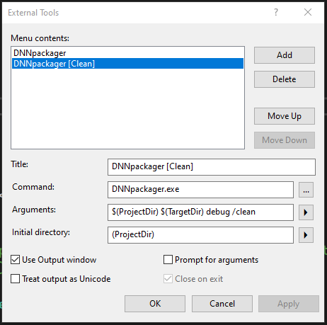

# DNNpackager

This console application will copy the installation files to the website, like when the module has been installed.  

It will also package a DNN module into an Install zip file.

A configuration file should be in the Project root folder: "DNNpackager.dnnpack".

Example:
```xml
<root>
	<version>1.0.0</version>
  <websitedestrelpath>\DesktopModules\DNNrocket\AppThemes</websitedestrelpath>
  <websitedestbinrelpath>\bin</websitedestbinrelpath>
  <!-- Include only files that match the regular expression -->
	    <regexpr>(\.cshtml|\.html|\.resx|\.dnn|\.png|\.jpg|\.gif|\.css|\.svg|\.js|\.xml|\.txt|\.md|\.aspx|\.ascx|\.ashx|\.woff|\.woff2|\.ttf)$</regexpr>
	<directory include='false'>
		<!-- All paths should be from the source root (project root) -->
		<value>\.git</value>
		<value>\.vs</value>
		<value>\bin</value>
		<value>\Components</value>
		<value>\Installation\Dist</value>
		<value>\Interfaces</value>
		<value>\obj</value>
		<value>\packages</value>
		<value>\Providers</value>
    <value>\render</value>
    <value>\SqlDataProvider</value>
    <value>\_external</value>
    <value>\ApiControllers</value>    
  </directory>
  <file include='false'>
  </file>
	<assembly>
		<value>RocketAppThemes.dll</value>
    <value>RocketAppThemes.pdb</value>
  </assembly>
</root>
```

Installation
------------

Use the Installation Package to install on the local machine or clone the repository from GitHub and compile.

Running From VS
-----------------
**NOTE: Close all website AppPools before running to unlocked files**

The operation is most easily ran from the "Post Build Event".  This automates the transfer of files from the working folders to the website folders.

The DNNpackager takes 1, 2 or 3 arguments.  

DNNpackager.exe \<ProjectDir\>\<Config Name (optional)\>

DNNpackager.exe \<ProjectDir\>\<Config Name (optional)\> \<ConfigurationName\>

DNNpackager.exe \<ProjectDir\>\<Config Name (optional)\> \<CopyDestination\> \<BinSource\> \<BinDestination\> \<ConfigurationName\>

arg1- **\<ProjectDir\>\<Config Name (optional)\>** = \$(ProjectDir)  The config .dnnpack file.  If the \<Config Name (optional)\> is omitted the project folder is searched for any ".dnnpack" file.  The .dnnpack file should be created on the project root folder.

arg2 - **\<BinSource\>** = The bin folder of the source module.  In VS tokens it is \$(ProjectDir)\$(OutDir) (optional)

arg3 - **\<ConfigurationName\>** = The VS configuration. \$(ConfigurationName) (optional)

**"/clean"** option can be added to the command.  This option will delete files on the "copy website" that do not exist in the project.  Use caution when using this, runtime files that have been added for plugin operations will be removed.

```
DNNpackager.exe $(ProjectDir) $(ProjectDir)$(OutDir) $(ConfigurationName) /clean
```

**"/debug"** option will pause the execution for 6 seconds, so the VS debugger can be attached.
```
DNNpackager.exe $(ProjectDir) $(TargetDir) $(ConfigurationName) /debug
```

Example from VS post build event:
```

C:\Program Files (x86)\Nevoweb\DNNpackager\DNNpackager.exe  $(ProjectDir) $(ProjectDir)$(OutDir) $(ConfigurationName)

```

If the directory of the exe is included in the windows PATH environment, you can minimise the line in VS post build event to:
```

DNNpackager.exe  $(ProjectDir) $(ProjectDir)$(OutDir) $(ConfigurationName)

```

**NOTE:** If the **\<ConfigurationName\>** is "razor" or starts with "nc-" DNNpackager will assume no compile has been made and will not copy the assemblies to the destination.


dnnpack.config File
---------------

The "dnnpack.config" file is required to copy files to the development website.  (Or Sync)

Example:
```
<root>
  <websitemappath>D:\Websites\dev.rocket.com\Install</websitemappath>
</root>
```
Deprecated Example:
```
<root>
  <websitebinfoldermappath>C:\Nevoweb\Websites\www.dnnrocket.com\Install\bin</websitebinfoldermappath>
  <websitedestfoldermappath>C:\Nevoweb\Websites\www.dnnrocket.com\Install\DesktopModules\DNNrocketModules\RE_CartPriceShipping</websitedestfoldermappath>
</root>
```

If no file exists in the project a blank XML file is created.


Copy to Working Folder
----------------------

If ONLY the $(ProjectDir) argument is passed to DNNpacker, a DNN install will be created.  You can associate the .dnnpack extension with DNNpackager, you can then double click on the .dnnpack file to build the installation.

If more arguments are passed DNNpackager can move files from your repo working area to your dev website area. This will allow you to create only 1 GIT repo on you dev machine and use it on multiple websites.

Files from the working area will be copied to the website folders.  

Files that do not exist in the source, but exist on the website will have the extension removed so they are not used by the webiste.  If a file must be included then it should be manually copied to the source folder.

A $(ProjectDir)\Installation folder should always be created. 

Running DNNpacker from VS using "release" config, will create an installation zip file for DNN.

Copy to Working Folder (Without Compile)
----------------------
When we want to copy files but do not want to compile and copy the assemblies.  (Doing this will cause the AppPool to recycle)  
The VS config deifnes if the projects are compiled or not.  
We create a config (usually debug) in the VS project that has ALL project compile turned off, we can then use this to Sync the files without a compile.  
Any files in the Git project folder will be copied to the website, if they are newer. 
use the "/clean" argument to reset the website folder to the git folder.

VS External Tool
----------------
You can also setup external tools in VS.  
*Tools>External Tools>*  
  

```
DNNpackager
DNNpackager.exe
$(ProjectDir) $(TargetDir) debug
$(ProjectDir)
```
*Copies only files that have changed in Git folder*

```
DNNpackager
DNNpackager.exe
$(ProjectDir) $(TargetDir) debug /clean
$(ProjectDir)
```
*Copies all files in Git folder and deletes files not in Git folder.*

Shortcut keys can also help.  Setup from >Tools>Options>Environment>Keyboard

Search for "Tools.ExternalCommand" to find the possible commands.  If you place the command in position 1 you can link to a key like this:
```
Tools.ExternalCommand1
```
```
Ctrl+Shift+1>
```


Working with Multiple Projects
------------------------------
Sometimes we want to work with multiple projects on the same website.  The "dnnpack.config" is looked for in the project file first, but if not found it will search in the parent folder until it finds a "dnnpack.config".

In the "dnnpack.config" file are the required website destination mappath to the website root.

```
<root>
  <websitemappath>D:\Websites\dev.rocket.com\Install</websitemappath>
</root>
```
This will be used, with the destination iformation in the "DNNpackager.dnnpack" file to move the files to the correct website folders.
```
  <websitedestrelpath>\DesktopModules\DNNrocket\AppThemes</websitedestrelpath>
  <websitedestbinrelpath>\bin</websitedestbinrelpath>
```
"websitedestbinrelpath" is optional.

Example:
```
DevFolder > Projects > Project1
DevFolder > Projects > Project2
DevFolder > Projects > Project3
```

The "dnnpack.config" file should be placed in ```DevFolder > Projects``` folder.  When each of the projects are compiled or DNNpacker run it will use the parent "dnnpack.config" (Unless you place a "dnnpack.config" file in the project folder).

The allows you to have multiple projects under 1 folder, that all use the same "dnnpack.config" file and hence the same website.


RUN AS ADMINISTRATOR
--------------------

You should run with administrator right, the BAT file below helps to do this.  right click the BAT file and "Run as Administrator".

```
REM ******** RUN AS ADMIN ***************

DNNpackager.exe %~dp0DNNpackager.dnnpack razor

PAUSE
```

